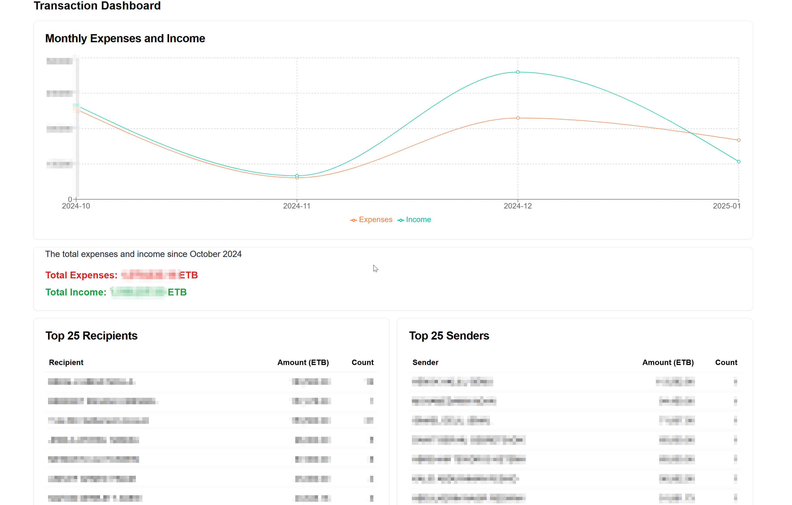
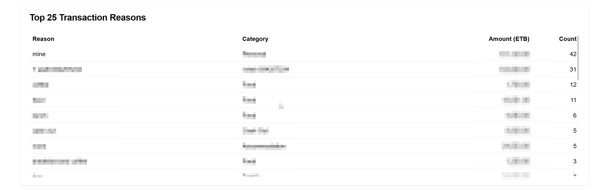
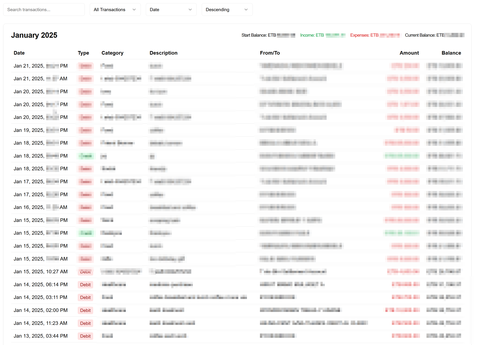
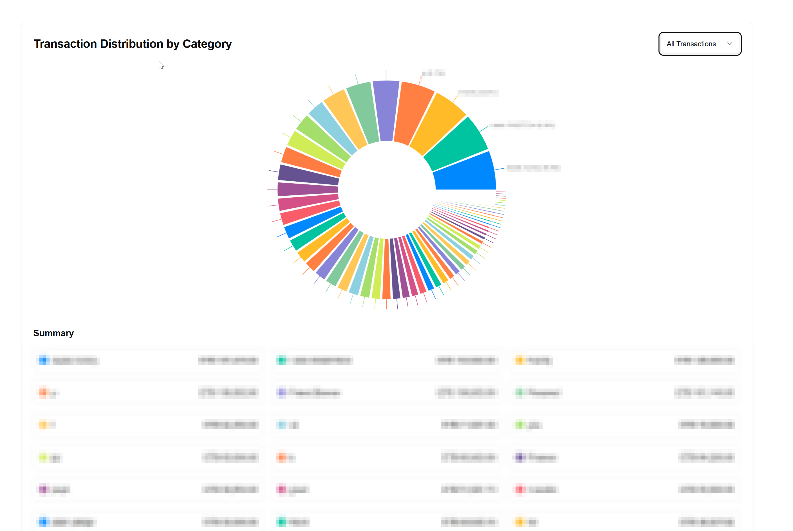

# CBE Transaction Analysis Dashboard

A powerful tool to analyze your Commercial Bank of Ethiopia (CBE) transactions by parsing SMS messages and transaction PDFs. This tool provides detailed visualizations and insights into your banking activities.






## Features

- 📊 Comprehensive transaction analysis
- 📱 SMS message parsing for both incoming and outgoing transactions
- 📄 Automatic PDF receipt parsing
- 💰 Category-based spending analysis
- 📈 Interactive visualizations including:
  - Monthly income/expense trends
  - Category distribution pie charts
  - Top receivers/senders analysis
  - Detailed transaction tables

## Prerequisites

### Python Requirements
- Python 3.8+
- httpx
- pypdf
- sqlite3
- pandas
- matplotlib
- seaborn

### Node.js Requirements
- Node.js 18+
- pnpm

### Important Notes

- **Ethiopian IP Address Required**: The PDF parsing functionality only works when running from an Ethiopian IP address due to CBE's regional restrictions
- **SMS Backup**: You need to export your CBE SMS messages using [SMS Backup & Restore](https://play.google.com/store/apps/details?id=com.jerryzigo.smsbackup)

## Setup Instructions

1. **Export SMS Messages**
   ```bash
   # Use SMS Backup & Restore app to export messages
   # Rename the exported file to sms-file.json
   ```

2. **Install Python Dependencies**
   ```bash
   pip install httpx pypdf pandas matplotlib seaborn
   ```

3. **Run Transaction Parser**
   ```bash
   # Place sms-file.json in the same directory as main.py
   python main.py
   ```

4. **Install Node.js Dependencies**
   ```bash
   pnpm install
   ```

5. **Start the Development Server**
   ```bash
   pnpm run dev
   ```

## Project Structure

```
├── app/
│   ├── actions/
│   ├── transactions.ts
│   │── categories.ts
│   ├── components/
│   │   ├── Dashboard.tsx
│   │   ├── MonthlyTransactions.tsx
│   │   └── CategoryPieChart.tsx
│   └── page.tsx
├── lib/
│   └── db.ts
├── main.py
└── category.json
```

## Configuration

- The default analysis starts from October 2024. To modify this, update the date check in `process_messages` function (line 140 in main.py)
- Category mappings can be customized in `category.json`

## Usage

1. After starting the development server, navigate to:
   - `http://localhost:3000` for the main dashboard

2. Use the interactive filters and controls to:
   - Search transactions
   - Filter by transaction type
   - Sort by different fields
   - View different time periods
   - Analyze category distributions

## Extending the Project

The project is designed to be easily extendable:

1. Add new visualizations:
   - Create new React components in `app/components`
   - Add new server actions in `app/actions`
   - Update the database queries in `lib/db.ts`

2. Modify transaction processing:
   - Update the SMS parsing patterns in `main.py`
   - Add new data extraction logic
   - Modify the database schema

## Limitations

- PDF parsing only works with Ethiopian IP addresses
- Currently optimized for CBE transaction messages
- Processes transactions from October 2024 onwards by default
- Requires manual SMS export using SMS Backup & Restore app


## Contributing

Feel free to submit issues and enhancement requests!

## License

This project is licensed under the MIT License - see the LICENSE file for details.

## Acknowledgments

- Thanks to CBE for providing transaction details via SMS
- SMS Backup & Restore app for easy SMS export functionality
- All the amazing open-source libraries that made this possible

---

💡 **Tip**: For better insights, maintain consistent categorization of your transactions in the `category.json` file.

For any questions or support, please open an issue on GitHub.